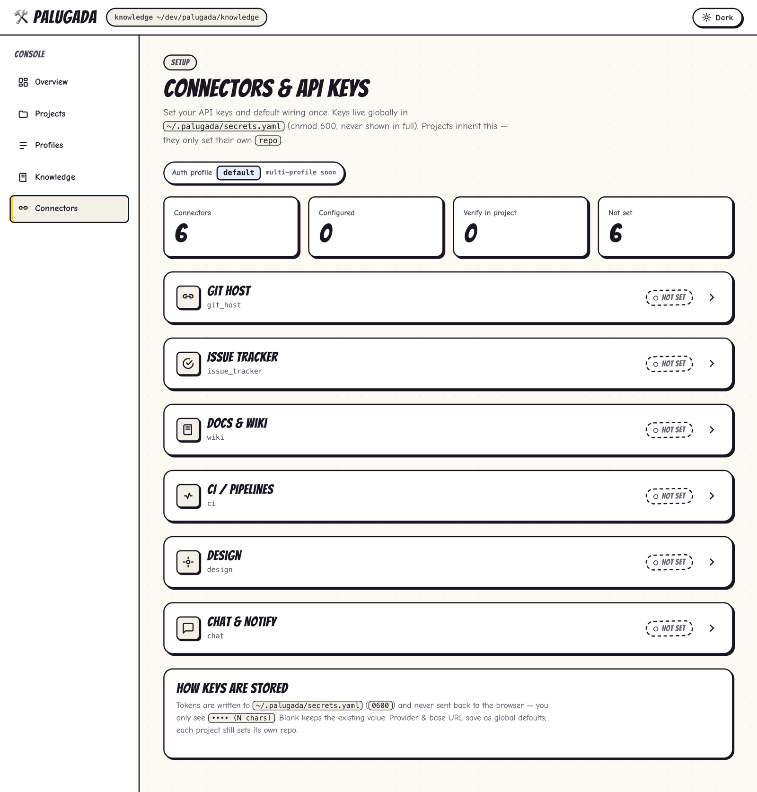

<div align="center">

# palugada

***"Apa lu mau, gua ada."*** — whatever your AI agent needs to know about your
repo, palugada already has it indexed.

[](https://github.com/yudistirosaputro/palugada-cli/actions/workflows/ci.yml)
[](https://github.com/yudistirosaputro/palugada-cli/releases)
[](https://www.npmjs.com/package/palugada-cli)
[](#what-palugada-init-generates)
[](LICENSE)

One binary that gives **any** project a token-cheap, always-current knowledge
layer, a local code index, and connectors to the tools your team already uses.

</div>

---

## Why palugada exists

AI coding agents are strong reasoners but **blind to your project**. To answer
"how do we do X *here*?" or "where is `LoginViewModel`?", an agent greps and
reads dozens of files — burning tokens, taking time, and ending up with context
that goes stale the moment someone refactors. The conventions that *would*
answer the question live in people's heads, in a wiki, or in a `CLAUDE.md` that
nobody keeps current.

So teams paper over it: they inline architecture notes into agent instruction
files (which bloat every prompt and rot fast), re-explain the same conventions
turn after turn, and still can't reach the knowledge sitting in Jira,
Confluence, GitLab, Figma, Jenkins, or Slack.

**palugada is the cheap, current source of truth an agent asks instead of
re-reading your codebase.** The name is the old Betawi joke *"apa lu mau, gua
ada"* — *whatever you want, I've got it* — a market stall that sells everything.
That's the pitch: one small CLI that already has the answer.

| The problem | What palugada does about it |
|---|---|
| Agents grep 50 files to find a symbol | `palugada symbol X` returns the definition from a local index — instantly, for a few tokens |
| "How do we do X here?" lives in someone's head | `palugada q <topic>` / `for <task>` read versioned **profile conventions & recipes** |
| Inlining knowledge into `CLAUDE.md` bloats context and goes stale | Generated agent skills are **references to commands**, not inlined text — small, and always current |
| Team knowledge is scattered across Jira/Confluence/GitLab/Figma/Jenkins/Slack | **Provider-agnostic connectors** — the same command works regardless of vendor |
| Setting up an AI agent per repo is fiddly | `palugada init` scaffolds config + agent files for Claude/Codex/Gemini/Cursor in one offline command |

## Before / after

**Before** — the agent burns context rediscovering what the repo already knows:

```
> where is the login view model and how do we handle errors here?
  …reads LoginActivity.kt, LoginFragment.kt, di/AppModule.kt,
    ui/login/*, util/Result.kt, base/BaseViewModel.kt … (12 files, ~9k tokens)
```

**After** — it asks palugada and gets a budgeted answer pack:

```bash
palugada symbol LoginViewModel        # → app/ui/login/LoginViewModel.kt:14  (class, signature)
palugada q errorhandling              # → the team's error convention, one section
palugada brief bugfix app/ui/login/LoginViewModel.kt   # recent commits + symbols + error/test convention, within a token budget
```

Same answer, a fraction of the tokens, and it never drifts from the checkout.

## How it works

palugada is four pieces behind one binary:

1. **A knowledge layer** — stack conventions (`q`), task recipes (`for`), and
   keyword search (`s`) read from bundled profiles (`android-mvvm`,
   `flutter-bloc`, `rust-cli`) with single-base **profile inheritance**
   (`extends`) plus a committable per-project convention overlay.
2. **A local code indexer** — `index` scans your repo into
   `<repo>/.palugada/index/` and builds a **generic symbol index** of every
   definition (class, object, function, method, property — with kind, enclosing
   scope, and signature) via a per-language tree-sitter tags query (Kotlin,
   Rust, Dart), so `symbol` finds functions, not just types. Curated **fact
   families** (viewmodel/route/…) are extracted alongside for the knowledge layer.
3. **Budgeted context packs** — `brief <flow>` assembles conventions + recipe +
   indexed facts into a **token-budgeted** pack for AI-agent work (bugfix,
   feature, refactor, review).
4. **Connectors** to the tools your team already uses — Jira / GitHub Issues,
   Confluence / Notion, GitLab / GitHub, Figma, Jenkins / GitHub Actions /
   GitLab CI, and Slack — behind provider-agnostic traits, so the same command
   works regardless of vendor. API keys are stored **globally, never committed**.

`palugada init` ties it together: it scaffolds a per-project config and agent
instruction files into any repo offline, with **no network needed**.

## What you can do

| Goal | Commands |
|---|---|
| Wire a repo up for AI agents in one shot | `palugada init` |
| Ask "how do we do X here?" | `palugada q architecture`, `palugada s error` |
| Get a step-by-step recipe for a task | `palugada for feature` |
| Search your code's symbols | `palugada index`, then `palugada symbol LoginViewModel` |
| Build a context pack for a bugfix/feature | `palugada brief bugfix path/to/File.kt` |
| Pull a ticket / wiki page / design file | `palugada issue view`, `wiki page`, `design file` |
| Check CI / git identity | `palugada ci status <JOB>`, `palugada git whoami` |
| Verify every configured connection | `palugada config verify` |

## Install

### Quick install (prebuilt — no clone, no Rust toolchain)

```bash
curl -fsSL https://raw.githubusercontent.com/yudistirosaputro/palugada-cli/main/install.sh | sh
```

This downloads the right prebuilt archive for your OS/arch from the
[Releases](https://github.com/yudistirosaputro/palugada-cli/releases) page,
**verifies its sha256** against the published checksum, installs the binary to
`~/.local/bin`, and keeps the bundled `knowledge/` profiles next to it so
`q` / `for` / `s` / `brief` work immediately. Pin a specific version with
`PALUGADA_VERSION=v0.2.4 curl … | sh`.

### Package managers

```bash
# npm (any OS with Node) — installs the right native binary automatically
npm install -g palugada-cli        # or run ad-hoc: npx palugada-cli q --list

# Homebrew (macOS / Linux)
brew install yudistirosaputro/tap/palugada

# Scoop (Windows)
scoop bucket add palugada https://github.com/yudistirosaputro/scoop-bucket
scoop install palugada
```

All three bundle the `knowledge/` profiles and wire them up automatically, so
`q` / `for` / `s` / `brief` work right after install. Publishing each channel is
opt-in — see [docs/PUBLISHING.md](docs/PUBLISHING.md).

### Manual download

Grab an archive for your platform from the
[latest release](https://github.com/yudistirosaputro/palugada-cli/releases/latest)
and extract it — the binary and its `knowledge/` dir ship together:

```bash
# example: macOS Apple Silicon
mkdir -p ~/.local/share/palugada
curl -fsSL -o p.tar.gz \
  https://github.com/yudistirosaputro/palugada-cli/releases/latest/download/palugada-aarch64-apple-darwin.tar.gz
tar xzf p.tar.gz -C ~/.local/share/palugada
ln -sf ~/.local/share/palugada/palugada ~/.local/bin/palugada   # if ~/.local/bin is on PATH
palugada --help
```

Archives are published for Linux x86_64, macOS arm64, macOS x86_64, and Windows
x86_64. **Keep the binary next to its `knowledge/` dir** — it locates the bundled
profiles by walking up from its own path (symlinks onto `PATH` are resolved). If
you move the bare binary elsewhere, point `PALUGADA_KNOWLEDGE` at the bundled
`knowledge/` directory.

### Build from source

Prerequisite: a stable Rust toolchain. If you don't have one yet:

```bash
curl --proto '=https' --tlsv1.2 -sSf https://sh.rustup.rs | sh   # installs rustup + cargo
```

Then build, smoke-test, and optionally install on your PATH:

```bash
cd tools/palugada
cargo build --release            # compiles; binary at ./target/release/palugada
./target/release/palugada --help # sanity check

cargo install --path .           # optional: install `palugada` into ~/.cargo/bin
```

No async runtime — HTTP is synchronous via `ureq`. The first build downloads
crates, so it needs network access once.

## Quick start

Credentials are entered **once** and live outside any repo; each project only
references an auth-profile by name.

```bash
# 1. scaffold global config + secrets (chmod 0600)
palugada config init

# 2. put your tokens into ~/.palugada/secrets.yaml (see example below),
#    or set them in the Connectors menu of `palugada web`

# 3. scaffold your repo: per-project config + agent files + registration
cd /Users/me/dev/my-app
palugada init                    # auto-detects the stack profile

# 4. test every configured connection
palugada config verify
```

Prefer manual setup? Instead of step 3, copy
[`examples/project.config.example.yaml`](examples/project.config.example.yaml)
to `<repo>/.palugada/config.yaml` and run
`palugada project add my-app /Users/me/dev/my-app`.

### What `palugada init` generates

```bash
palugada init [--repo .] [--name my-app] [--profile android-mvvm] \
              [--auth default] [--agents claude,codex,gemini,cursor] [--force]
```

| Target | Files written |
|---|---|
| (always) | `<repo>/.palugada/config.yaml` + registration in `~/.palugada.yaml` |
| `claude` (default) | thin `CLAUDE.md` pointer + `.claude/skills/palugada-{search,bugfix,feature,refactor,review}/SKILL.md` + tool skills `palugada-{git,docs,ci,design}` (gated by configured integrations) |
| `codex` | `AGENTS.md` (single richer guide) |
| `gemini` | `GEMINI.md` (single richer guide) |
| `cursor` | `.cursor/rules/palugada.mdc` |

The generated skills are **references to palugada commands** (never inlined
knowledge), so they're token-cheap and **follow the active profile
automatically** — a `palugada profile use <id>` switch needs no regeneration.
`palugada-search` enforces the "use `palugada symbol`/`fact` before grep" rule.
Re-emit them anytime with `palugada skills sync` (writes missing files; skips
existing so your edits survive — `--force` to overwrite).

**Per-profile custom skills.** A profile can carry its own stack-specific skills
in `knowledge/profiles/<id>/skills/<name>/SKILL.md`; `init` / `skills sync` emit
them into a bound project's `.claude/skills/` alongside the standard set (Claude
only). Scaffold one with `palugada skills new <name> [--profile <id>]` (names
can't use the reserved `palugada-` prefix).

The stack profile is auto-detected (Gradle files → `android-mvvm`,
`package.json` → `web-react`); existing files are skipped unless `--force`.
Everything is offline — tokens stay in `~/.palugada/secrets.yaml`.

## Commands

| Command | What it does |
|---|---|
| `palugada init` | scaffold a repo: config + agent files + registration (offline) |
| `palugada config init` | create `~/.palugada.yaml` + `~/.palugada/secrets.yaml` |
| `palugada config show` | print config + **masked** credentials |
| `palugada config verify` | connectivity + auth check for the active project's providers |
| `palugada project add <name> <repo_path>` | register a project |
| `palugada project list` | list registered projects (`*` = active) |
| `palugada project use <name>` | set the active project |
| `palugada project remove <name>` | unregister a project (files on disk untouched) |
| `palugada profile list/validate/new` | list, lint, or scaffold a stack profile |
| `palugada profile use <id>` | bind the active (or `--project`) project to a profile (config flip; re-index only for new fact families) |
| `palugada skills sync [--force]` | (re)generate the project's agent skill files (writes missing; skips existing unless `--force`) |
| `palugada skills new <name>` | scaffold a per-profile custom skill (`profiles/<id>/skills/<name>/`) |
| `palugada q <topic>[.N]` | read a convention from the active profile (`-b` outline, `--list`) |
| `palugada for <task>` | read a recipe from the active profile (`--list`) |
| `palugada s <kw>` | search conventions + recipes by keyword |
| `palugada index` | scan the project's code → `<repo>/.palugada/index/` (local, per-dev) |
| `palugada symbol <query> [--kind K]` | search indexed definitions (class/function/method/…) by name; `--kind` filters |
| `palugada fact <family> [name]` | look up indexed facts of a profile-declared family (e.g. `fact viewmodel Login`) |
| `palugada brief <flow> [target]` | one budgeted context pack for a flow (`--budget`, `--json`) |
| `palugada issue view <KEY>` | fetch an issue (Jira) |
| `palugada wiki page <ID>` | fetch a page (Confluence) |
| `palugada git whoami` | authenticated git-host user (GitLab/GitHub) |
| `palugada pr recent <file>` | recent commits touching a file, from the git host (needs `repo`) |
| `palugada design file <KEY>` | a design file's metadata (Figma) |
| `palugada ci status <JOB>` | last build status of a CI job (Jenkins) |
| `palugada notify <msg>` | send a message to the project's chat (Slack webhook) |
| `palugada prd fetch/list/cat/search` | personal corpus of fetched tickets in `~/.palugada/personal/` |
| `palugada exec <verb> [k=v…]` | run a profile/project-declared shell verb (`--list`, `--json`) |
| `palugada doctor` | check tool + connector readiness (`--json`); non-zero exit on failure |
| `palugada web [--open]` | local authoring console (browse + create profiles/knowledge, generate agent skills) |

Global flags: `--project <name>` (override active), `--insecure` (accept
self-signed TLS for corporate hosts), `--version`. Every invocation needs a home
directory — `HOME`, or `%USERPROFILE%` on Windows — to locate `~/.palugada.yaml`
and `~/.palugada/secrets.yaml`.

## Using the knowledge layer

`q` / `for` / `s` read the bundled profile under `knowledge/profiles/`. The CLI
finds that directory via (in order) the `PALUGADA_KNOWLEDGE` env var,
`engine.knowledge_path` in `~/.palugada.yaml` (auto-recorded by `palugada config
init` when run from the repo), or by walking up from the binary. The active
profile resolves from the project's config → `defaults.profile` → the sole
bundled profile.

```bash
palugada q --list                 # what topics does this profile cover?
palugada q architecture           # full convention; `q architecture.2` = one section
palugada for feature              # recipe: how to build a feature here
palugada s viewmodel              # keyword search across conventions + recipes
```

`brief <flow>` runs the step list declared under `flows:` in the profile and
packs the result within `--budget` tokens. Example:

```bash
palugada index                          # once, to populate facts
palugada brief bugfix path/to/File.kt   # recent commits + symbols + errorhandling/testing
palugada brief feature TICKET-123 --budget 1500 --json
```

## Running tasks & diagnostics (`exec`, `doctor`)

`exec` runs named **verbs** — shell command sequences declared under `exec:` in
the active profile and/or `<repo>/.palugada/config.yaml`. The project's map
overrides the profile's per verb. `{key}` placeholders are filled from `k=v` args.

Every bundled profile ships sensible **`build` / `test` / `lint` / `run`** verbs
for its stack — `rust-cli` → `cargo`, `flutter-bloc` → `flutter`, `android-mvvm`
→ `gradle` — so `palugada exec build` runs the right tool **according to
the project's profile** out of the box. Override any verb per-repo in
`.palugada/config.yaml` (e.g. point `build` at a melos workspace task).

```bash
palugada exec --list                       # verbs available in this repo
palugada exec build                        # run the `build` verb
palugada exec install apk=app/out.apk      # fill {apk} from the k=v arg
palugada exec test --json                  # capture a JSON outcome instead of streaming
```

Each verb may set `timeout_secs` (default 600; `0` = unlimited). palugada exits
with the child's exit code (a timeout exits 124 and kills the whole process
group), so agents and CI can branch on it.

**Repo-defined verbs are gated (trust-on-first-use).** A verb declared in a
cloned repo's `.palugada/config.yaml` runs a shell command from that checkout,
so the first time you run one palugada shows the command and asks for approval,
caching it per `(repo, verb)` in `~/.palugada/exec-trust.json` (editing the verb
re-prompts). Profile-bundled verbs are trusted. In trusted CI, approve
non-interactively with `--yes` or `PALUGADA_TRUST_REPO_EXEC=1`. **AI agents
should not auto-approve verbs from repositories you don't trust.**

`doctor` checks repo readiness: it runs the `doctor` verb (tool checks) and, when
a project + connectors resolve, verifies each connector. It exits non-zero if any
check fails; `--json` emits `{ok, checks[]}`.

```bash
palugada doctor
palugada doctor --json
```

## Web console (`palugada web`)

An **optional** local authoring console for humans. It does not change how agents
consume palugada (that stays the cold CLI) — it's a browser GUI over the same
config/profile/knowledge files, so you can author without hand-editing YAML/markdown.

```bash
palugada web --open        # serves http://127.0.0.1:7777 and opens your browser
```

<div align="center">



<sub>The **Connectors** view: set every provider's API key once, globally, with an in-place Verify.</sub>

</div>

The sidebar has five sections:

- **Overview** — workspace stats (profiles, projects, knowledge dir).
- **Projects** — registered repos; open one to switch its bound profile, edit its
  per-project **Credentials & Integrations**, read the generated **skill-flow map**
  (which palugada step each skill routes to), and manage its committable
  **convention overlay** + `review_map`.
- **Profiles** — browse/author any stack's conventions & recipes (rendered, split
  into token-cheap sections), edit **flows**, wire up profile **inheritance**
  (`extends`), and import markdown docs (split by heading into conventions).
- **Knowledge** — read the active profile's conventions & recipes.
- **Connectors** — set your **API keys + default provider wiring** once, globally:
  each connector (Git host, Issue tracker, Docs & Wiki, CI, Design, Chat) is a card
  with a provider dropdown, base URL, a masked key field, and an in-place
  **Verify** button. Projects inherit the wiring and only set their own `repo`.

Everything writes the files the CLI reads — no database. The server binds to
loopback only and accepts only `localhost` Hosts. **Secrets are write-only and
always masked on read** — the plaintext token is never sent to the browser, and a
blank key field keeps the stored value; the per-click **Verify** is the only
outbound network call.

## Configuration

### `~/.palugada/secrets.yaml` (example — never commit)

```yaml
auth_profiles:
  default:
    # Atlassian Cloud: set the *_email fields to use Basic auth (email + API
    # token). Leave them empty for Server/Data Center, which uses a Bearer PAT.
    jira_email:    "you@example.com"
    jira_token:    "PASTE_JIRA_API_TOKEN_OR_PAT"
    wiki_email:    "you@example.com"
    wiki_token:    "PASTE_CONFLUENCE_API_TOKEN_OR_PAT"
    git_token:     "PASTE_GIT_PAT"
    figma_token:   "PASTE_FIGMA_TOKEN"
    jenkins_user:  "your-username"
    jenkins_token: "PASTE_JENKINS_API_TOKEN"
    chat_webhook:  "https://hooks.slack.com/services/PASTE/WEBHOOK/URL"
```

### `<repo>/.palugada/config.yaml` (example)

See [`examples/project.config.example.yaml`](examples/project.config.example.yaml).
Each integration names a provider. Implemented today: issue tracker `jira` or
`github_issues` (set `repo: owner/name`); wiki `confluence` or `notion`; git host `gitlab`
or `github`; design `figma`; CI `jenkins`, `github_actions`, or `gitlab_ci`; chat
`slack`. Other providers (Linear, …) are roadmap only — selecting one is a hard error.

## Layout

```
src/
├── main.rs            clap dispatch + command handlers
├── config.rs          GlobalConfig / Secrets / ProjectConfig + per-field resolution
├── credentials.rs     web credentials/connectors — masked view, apply, verify
├── web.rs  + web/     `palugada web` server + vanilla-JS console (index.html/app.js/style.css)
├── http.rs            ureq helper (Bearer/header auth, --insecure TLS)
├── scaffold.rs        `palugada init` — offline agent-file + config scaffolding
├── knowledge.rs       `q` / `for` / `s` — read conventions/recipes from a profile
├── inherit.rs         profile `extends` chain resolution (live, per-section)
├── effective.rs       per-project convention overlay + effective-rules merge
├── profile.rs         `profile list/validate/new`, flows editor, render checks
├── indexer.rs         `index` / `symbol` — scan code → <repo>/.palugada/index/
├── brief.rs           `brief` — budgeted flow context packs
├── exec.rs            `exec` / `doctor` — profile/project shell verbs + JSON outcome
└── clients/
    ├── mod.rs                              capability traits + factories
    ├── jira.rs / github_issues.rs          IssueTracker
    ├── confluence.rs / notion.rs           DocSource
    ├── gitlab.rs / github.rs               GitHost
    ├── figma.rs                            DesignSource
    ├── jenkins.rs / github_actions.rs / gitlab_ci.rs   CiProvider
    └── slack.rs                            ChatNotify (webhook)
knowledge/profiles/    bundled stack profiles (android-mvvm, flutter-bloc, rust-cli)
```

## Roadmap

- Wiki tie-in for `prd.context` (a ticket's linked Confluence/Notion spec) — the
  `feature` flow currently packs the issue summary + description only.
- More tree-sitter grammars (Swift, TS, Go, Python) and typed fact aliases
  (`viewmodel` / `service` …) layered over the generic `fact` command.
- More providers as demand dictates (Linear for `issue_tracker`, Teams/DingTalk
  for `notify`).

There is **no `sync`**: the index is local to each developer — `palugada index`
regenerates it from the local checkout; nothing is pulled from a shared corpus.

## Contributing

See [CONTRIBUTING.md](CONTRIBUTING.md) for the local build/test workflow, coding
conventions, and how to add a connector or knowledge profile. Maintainers: see
[docs/PUBLISHING.md](docs/PUBLISHING.md) for releases.

## License

[MIT](LICENSE) © 2026 Yudistiro Saputro.
